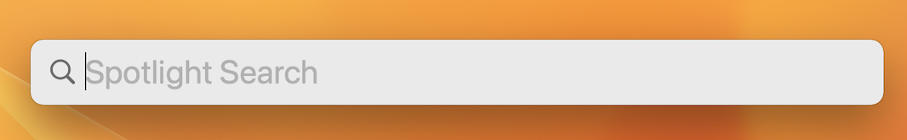

# Getting Started

## Intro to Terminal
Many of the Git commands are run in Terminal. What is Terminal? The Mac Terminal is a command line interface (CLI) for the MacOS operating system (OS). Percy Grunwald from TopTechSkills has an excellent 15min video about Terminal for beginners. Please take a moment to view the [video](https://www.youtube.com/watch?v=aKRYQsKR46I) and familiarize yourself with Terminal then come back here. If interested in learning more on your own time, a more in depth explanation can be found [here](https://www.youtube.com/watch?v=ogWoUU2DXBU). 

## Do you have Git installed?
Since we will be working with Macs, all steps represent MacOS. Most MacOS computers have Git pre-installed you just have to get it activated. If you want to work from home you have to take a couple more steps (more details in step 3). 

1. Press the Command key + Spacebar on the keyboard to open [Spotlight](https://support.apple.com/guide/mac-help/search-with-spotlight-mchlp1008/mac). For windows keyboards the **Windows** key is used in place of the Command key.  When you do this the Spotlight Search bar will appear:



2. Enter the word "Terminal" in the spotlight search and select Terminal from the list. A Terminal window will open:


3. Make sure to confirm that you have Git installed. You can do this by running the following command in Terminal:
```
$ git --version
```
Terminal will output something like this:
```
git version 2.39.2
```

Not installed? Here is a guide on how to install Git on your computer: [Install Git](https://git-scm.com/book/en/v2/Getting-Started-Installing-Git). Follow the steps in order to install Git (make sure to follow steps for your operating system - MacOS or Windows ). 

4. Once you have Git installed we need to customize the environment. Before we do that, do you have a GitHub account? If you do, great, if not, please create one here [GitHub Sign Up](https://github.com/signup?ref_cta=Sign+up&ref_loc=header+logged+out&ref_page=%2F&source=header-home). Make sure to use your **personal** email when creating the GitHub account. You will need to create a GitHub account in order to remotely access the repository. Remember, *Git* is local, *GitHub* is remote. Please create the GitHub account and come back here.   

5. Once you have confirmed that Git is installed, you'll want to customize the environment. 

Open Terminal on your Mac. From the Terminal command prompt let's make sure to set up your identity by setting your user name and email address. This is important because every Git commit uses this information, and it’s immutably baked into the commits you start creating. In Terminal enter the following (enter **your** information inside the quotation marks): 
```
$ git config --global user.name "your-github-user-name"
$ git config --global user.email "your@email.com"
```

If you want to check your configuration settings enter the following command in Terminal:
```
git config --list
````
This command will list all the settings Git can find at that point (yours will look different):
```
$ git config --list
user.name=John Doe
user.email=johndoe@example.com
color.status=auto
color.branch=auto
color.interactive=auto
color.diff=auto
```
There are a lot of Git commands and you are not expected to know them all. You can always use a reference for the [Git commands](https://git-scm.com/book/en/v2/Appendix-C%3A-Git-Commands-Setup-and-Config) or download one of the following cheat sheets: 
[GitHub Education Git Commands Cheat Sheet](images/git-cheat-sheet-education.pdf) or [GitLab Git Commands Cheat Sheet](images/images/git-cheat-sheet.pdf)


## [Next - Step 3: Working in a Team](3_TeamRepository.md)
