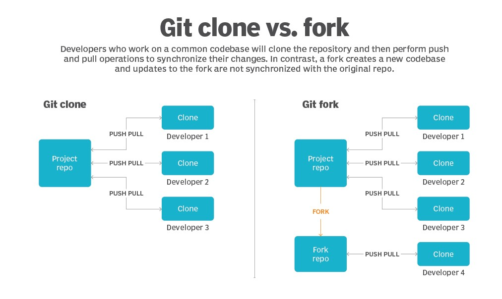
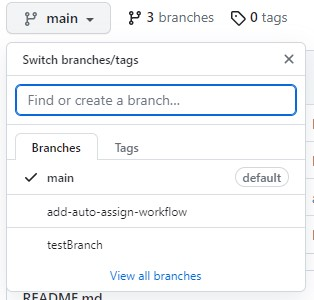

# Working in a Team:  

You have an idea of what Git and GitHub are, and you have installed both of them as well. Maybe you've even pushed some of your code to your remote repository. Congratulations! Have you worked with others on the same code? Ahh, that can be interesting. One of the many benefits of Git is that it allows many developers to work on the same code at once. There is a process for doing that. While there may be slight differences between organizations, they follow these general steps:

   #### Step 1. Clone or fork repository
   #### Step 2. Create a branch in your repository
   #### Step 3. Make changes to your branch. Commit, and push your changes
   #### Step 4. Create a pull request
   #### Step 5. Address review comments
   #### Step 6. Merge your pull request
   #### Step 7. Delete your branch
 
## To clone or to fork, that is the question..... ?
Any public Git repository can be forked or cloned. A fork creates a completely independent copy of Git repository. In contrast to a fork, a Git clone creates a ***linked*** copy that will continue to synchronize with the target repository. So if you wan to 

When a Git repository is cloned, the target repository remains shared amongst all of the developers who had previously contributed to it. Other developers who previously contributed to that codebase will continue to push their changes and pull updates from the cloned repository. Any developer who clones a repository can synchronize their copy of the codebase with any updates made by fellow developers.

In contrast to a clone, a Git fork operation will create a completely new copy of the target repository. The developer who performs the fork will have complete control over the newly copied codebase. Developers who contributed to the Git repository that was forked will have no knowledge of the newly forked repo. Previous contributors will have no means with which they can contribute to or synchronize with the Git fork unless the developer who performed the fork operation provides access to them.

When a repository is forked, developers who plan to work with the new codebase (i.e. the forked codebase) will still need to perform a git clone operation on the forked repository. You'll still need to run push and pull operations to synchronize local changes with the forked repo, as shown in the diagram below. However, changes and updates to the forked repository will be isolated to the fork and will not be reflected in the original repo.



## What’s the difference between a Pull and a Push?
The difference between a “pull” and a “push” is as intuitive as you think. A developer will pull to request a target repository to pick up their local changes and merge them into the existing code. A push is not a request, but a **command** (git push) used to “upload” local content or changes to a remote repository. Many of you have been pushing your code to your own repository. 

## What is a pull-request:
A pull request is an event to notify software developers that a team member has pushed code to a specific Git branch (or a specific version of the code repository) for a colleague to review. Once a developer opens a pull request, your team can review the potential changes introduced before merging with the central repository branch. 

## The Anatomy of a Good Pull Request 
Whenever a developer opens a pull request, they should be sure to include all of the following components: 

### The Title
The title should be a meaningful summary of the purpose of the PR. Often this can correspond to a ticket, service, or component. 

### The Description
The description should include changes the developer introduced so the reviewer knows what to look out for. 

### Commits
Each relevant commit should be included in your PR and each commit should have a concise description of code changes. 


This repository will be a simple web page that everyone contributes to. Contribution will be limited to adding info to the website. Please note that letters in <italics> are examples and % is the Terminal prompt.  

 

1. In Terminal navigate to your work folder and create a new folder for the exercise:   
```
%mkdir c14Website 
```

2.  Change to the folder:  
```
%cd c14Website  
```
3. Clone the directory. You can get the clone address by navigation to the repository and click on <>Code and copy the HTTPS URL address 

```
%git clone https://github.com/<YOUR-REPOSITORY> 	 
```
4.  Create a branch for your changes: 
```
%git branch <branch-name> 
```
5. Switch to the new branch: 
```
%git checkout <branch-name> 
```
6. Now you can push this branch up to git hub:  
```
%git push –u origin <branch name> 
```

7. Check that the branch has been successfully pushed up. To confirm that the branch has been pushed, head over to GitHub and click the branches drop-down. You should see the branch there: 



Now that you have a local branch and have it showing up remotely you can make changes to the local repository.  

STOP! Always check to see what branch you’re on. To check to see what branch you are on enter the following command in Terminal:  

%git status 

 

Git Status in Depth: Understanding Your File States | CloudBees 

This will let you know what branch you are currently on other pertinent information about files.   

Make changes to the home.html page. Make the following changes: 

Add your First and Last Name 

A sentence that mentions some of your hobbies (i.e. “My hobbies are reading, playing D&D, and hiking”) 

Your autest email address.  

DO NOT CHANGE IMAGE 

Once you are satisfied with your changes proceed to add the file and commit your changes: 

%git add home.html 

%git commit –m “Your comments here” 

%git push 

 

 
