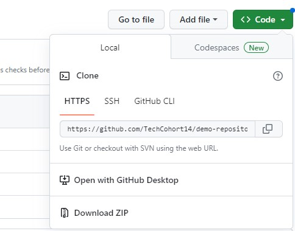
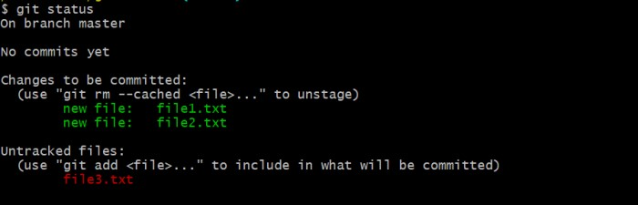

# Team Web Site!!
For our team project we will work on a website that will NOT be publicly available. It will only run locally on your invidual machines.  

This repository will be a simple web page that everyone contributes to. Contribution will be limited to adding personal info to the website. Please note that letters in between greater than and less than ( `<example>` ) are examples and `%` is the Terminal prompt.  

 

### 1. In Terminal navigate to your work folder and create a new folder for the exercise:   
```
%mkdir c14Website 
```

### 2. In Terminal Change to the folder:  
```
%cd c14Website  
```
### 3. Clone the directory. You can get the clone address by navigation to the repository and click on green <>Code and copy the HTTPS URL address 
  
 In Terminal clone the repository: 
 
```
%git clone https://github.com/TechCohort14/TA100-GitFlowWebsite.git 	 
```

### 4.  Create a branch for your changes:  
Once you have a clone of the repository you will be on the main/master branch. Best practice is to NOT make changes to the main/master branch. Why is it so important to not make changes to the main branch? One word: deployable. It is your production code, ready to roll out into the world. The master/main branch is meant to be stable, and it is the social contract of open source software to never, ever push anything to master that is not tested, or that breaks the build. The entire reason GitHub works is that it is always safe to work from the master.
 
Now that the importance of the main/master branch is established, let's create a branch to work in. Projects will have naming conventions for files, folder, branches (i.e. by issue, by feature, hotfix, ticket number, etc.), and coding. For our project when creating a branch make sure to follow this naming convention for branches: firstnameFeature   <br>
First name is lowercase, the first letter of the "Feature" is uppercase. Suppose, team member Ryan is working on updating the picture then the branch name would be: <br>
 _ryanPicture_ 
 
```
%git checkout -b <firstnameFeature> 
```

 The `%git checkout -b` is doing TWO commands at once and is good practice. It is creating a branch **AND** checking it out with option `-b`. To just create a branch you can use the following command `git branch <branchName>`. However, you will have to remember to check it out.. . and if you don't checkout the new branch you will be making changes to the main/master branch. Which means you would be breaking the social contract! To avoid this painful mistake of forgetting to switch to a newly created branch when creating a new branch just use `%git checkout -b`. 
 
 To switch to a branch you will use `git checkout <branchName>`. We will use this later on. 
 
### 5. Checkout the new branch: 
STOP! Always check to see what branch you are on. To check to see what branch you are working on enter the following command in Terminal:  
 
```
%git status 
```
   
 
You created a branch, but you must check it out. If you don't change to the branch you will be making changes to the main branch and your changes will NOT be accepted when submitting your changes. Essentially, you will have lost your code 😢. <br>
 
```
%git checkout <yourfirstnameFeature> 
```
### 6. Now you can push this branch up to git hub:  
```
%git push –u origin <branch name> 
```
### 7. Check that the branch has been successfully pushed up. To confirm that the branch has been pushed, head over to GitHub and click the branches drop-down. You should see the branch there: 


Now that you have a local branch and have it showing up remotely you can make changes to the local repository.  

### 8. Make the assigned changes to the website
Each person will be assigned the scetion of code they will change
 
### 9. Commit changes to your branch


Once you are satisfied with your changes proceed to add the file and commit your changes: 

%git add home.html 

%git commit –m “Your comments here” 

%git push 

 

 

