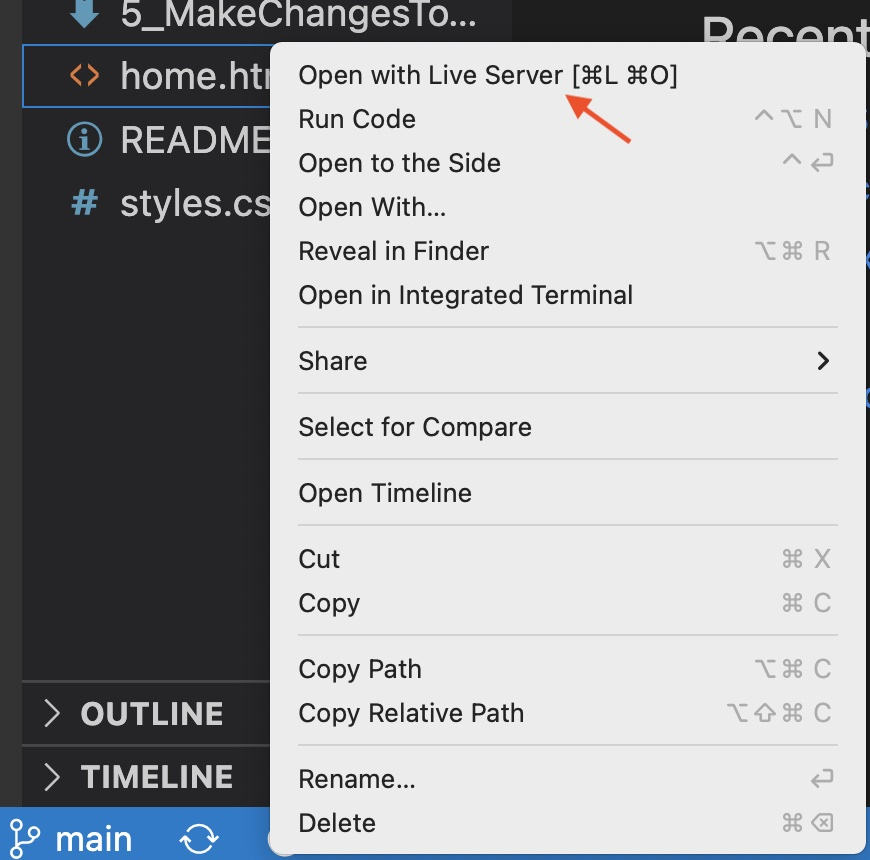
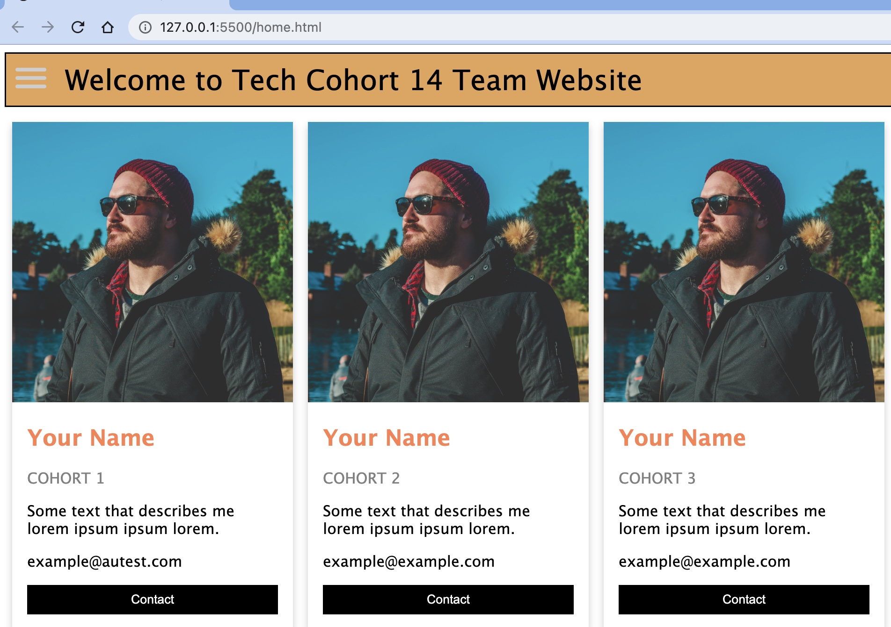

# Team Website Contribution
Now you get to make some changes. The website has "cards" to display some information for each cohort. Each person will be assigned a cohort number and will only make changes to that "card". 

### 1. Navigate to your folder:
Open Terminal and navigate to your project folder. Make sure to checkout the branch you created earlier and check status - this is important.
```
%git checkout <yourBranch>
```

### 2. Open Visual Studio Code (VS Code):
While in Terminal open VS code by entering the following command:
```
%code .
```
VS Code will open in the corresponding folder. If this does command does not launch VS Code for you, please follow these [instructions](https://code.visualstudio.com/docs/setup/mac) to configure this shortcut from Terminal.  

### 3. Preview your work
In order to preview your work in your browswer use Live Server. This is a VS code feature that will show a "live" version of the website and will update whne ou make chnages in the html. To access right click on the `<>home.html` file and select Open with Live Server from the pop up menu. 

 

The webpage will open in your browser and should look like this:

 

### 4. Make the assigned changes to the website
Each person will be assigned a cohort card number. You can find your assigned Cohort number in the the HTML under "title" ```<p class="title">COHORT 1</p>```. 
```
 <div class="column">
          <div class="card">
            
            <div class="container">
              <h2>Your Name</h2>
              <p class="title">COHORT 1</p>
              <p>Some text that describes me lorem ipsum ipsum lorem.</p>
              <p>example@example.com</p>
              <p><button class="button">Contact</button></p>
            </div>
          </div>
        </div>
        
 ```       
You will update the following: 
- Upload your picture to the image folder (shoulder and up). We can take picture here. 
- Change the `img src=` to point to the image you uploaded
- In the `<h2>Your Name` enter your First and Last Name
- In the `<p>Some text...` enter short sentence that describes somethign about you (i.e. maybe a hobby, that you are a Tech Participant at NFAR, etc.)
- in the `<p> example@example.com` enteryour@autest.net email address

### 5. Commit changes to your branch

```
%git add home.html

%git commit –m “changes to card "#" ”

%git push
```
