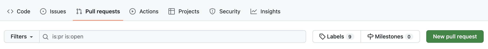
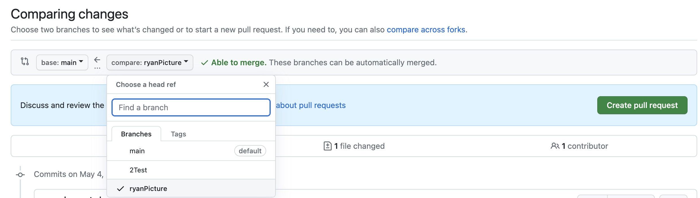
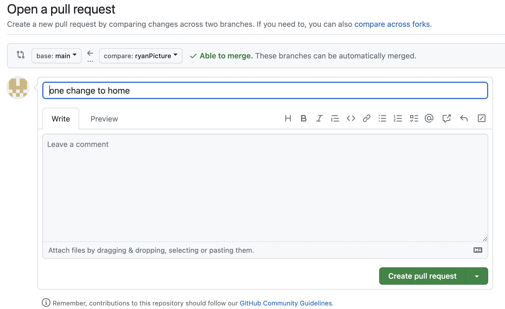

# Submit a Pull Request

You pushed your branch changes and you are now ready to merge into the main branch.  A project will have certain rules around pull requests. In 99.9% of cases you will NOT be able to merge your changes directly into the main branch without a review and approval from another member of the project. This is to protect the main branch from any code that could break it. Remember that "social" contract? 


The main branch is typically the repository that everyone can count on to work. So, it must be protected from anything that can break it. If you checked everything and are ready to submit your pull request proceed as follows:  

### Start the Pull Request:
1. Navigate to the GitHub repository and click on Pull requests topward the top of the screen.<br>
2. Click on the green "New pull request" button. 



3. By default the "base:main" branch will show up in the left dropdown box. Select your branch from the right dropdown box and then click on the green "Create pull request" button



### Pull Request Comments
The pull request comment window will open and the title will have your commit comment. Make sure the title is concise, but at the same time descriptive of why you are requesting your changes to be merged. You can change the title if you think your original commit comment was not descriptive enough. 

Writing a good pull request will determine if your changes will be merged or not. Please read this [article](https://www.pullrequest.com/blog/writing-a-great-pull-request-description/) before filling out your pull request description then come back here.  

Great article, right? Your team will hopefully have some guidelines around writing a pull request. For our team, please use the following template for your pull request. 

```
- What?
- Why?
- How?
- Testing?
- Screenshots (optional)
- Anything Else?
```
Make sure to fill out each area as described in the article. 




