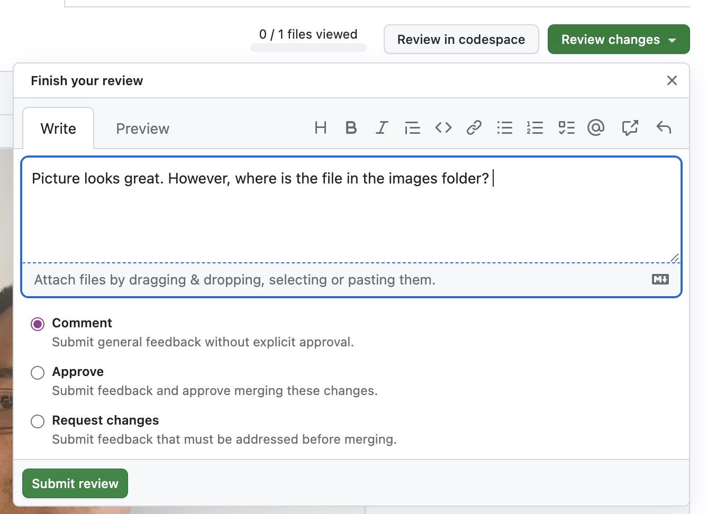
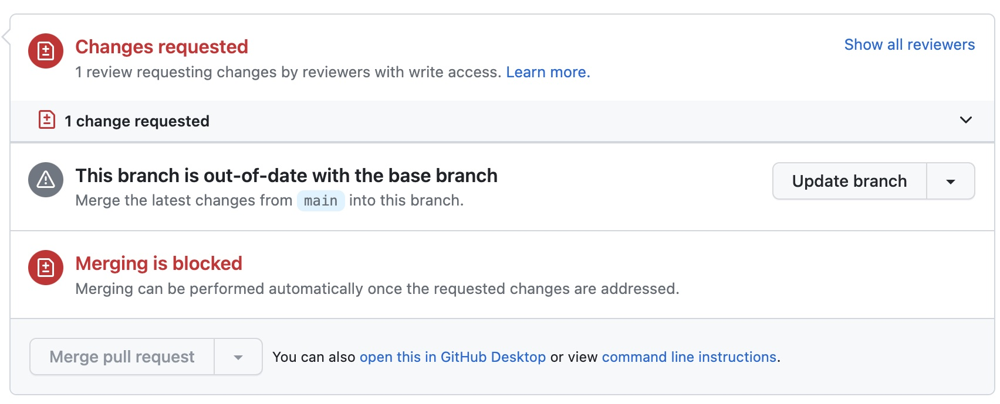

# Pull Request Review
Now that you submitted your pull request it needs to get reviewed and approved. Team members will have the ability to review your code and make comments, request changes, or approve. Each pull request must have one review before it gets approved and merged. Merging will **ONLY** be done by the Team Leader. Please do not merge any changes.  

Ask another team member to review your pull request. If you have reviewed a pull request already, please make sure to give someone else a chance to conduct a review.


### Selecting a Pull Request 
When asked to review a pull request, navigate to Git Hub and click on Pull Requests. Find the pull request you were asked to review and click on the pull request title. 

The screen below will appear. Click on "add your review".  


The screen will change and it will provide a comparison of the original file on the left and the submitted changes on the right. Any uploaded images will be further down on the page. 

#### What to review? 
You are reviewing the following: 
- HTML (any typos? is the syntax correct?)
- Did they submit the picture correctly (is it square? is it clear? does it show the person?)
- Did they submit a screen shot of the completed card?
- Did they submit comments following the standard (see below for a refresher)?
```
- What?
- Why?
- How?
- Testing?
- Screenshots (optional)
- Anything Else?
```
If everyhting is ok, then you can approve and submit. Something needs changes? Then click on 



If someone requested a change to your pull request you can view their request here: 




