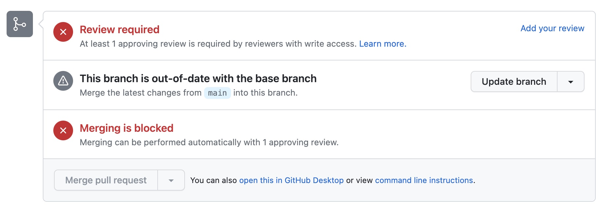

# Pull Request Review
Now that you submitted your pull request it needs to get reviewed and approved. Certain team members will have the ability to review your code and make comments, request changes, or approve. Each pull request must have one review before it gets approved and merged. 

In our team you will have another team member review your pull request. Only the team leader will be able to approve it and merge it. When you click on 

