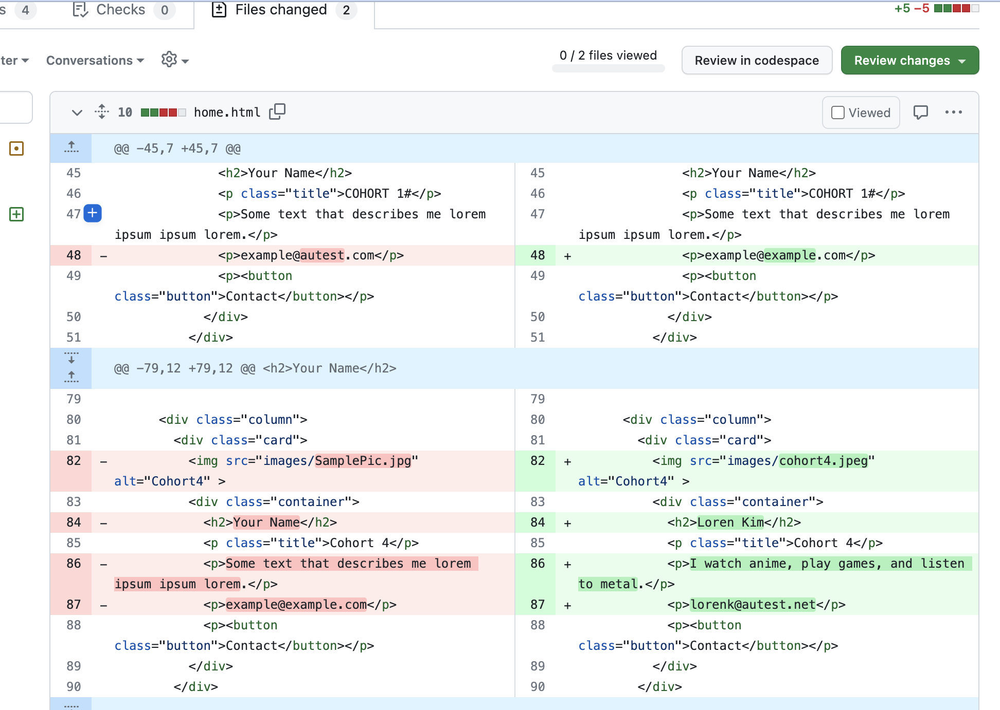

# Pull Request Review
Now that you submitted your pull request it needs to get reviewed and approved. Team members will have the ability to review your code and make comments, request changes, or approve. For our team, each pull request must have one review before it gets approved and merged. Merging will **ONLY** be done by the Team Leader. Please do not merge any changes.  

Ask another team member to review your pull request. If you have reviewed a pull request already, please make sure to give someone else a chance to conduct a review.


## Selecting a Pull Request 
When asked to review a pull request, navigate to Git Hub and click on Pull Requests. Find the pull request you were asked to review and click on the pull request title. 

The screen below will appear. Click on "add your review".  


The screen will change and it will provide a comparison of the original file on the left (red) and the submitted changes on the right (green). Notice how changes are highlighted. Any uploaded images will be further down on the page. 



### What to Review? 
It is your responsibility to review the proposed changes from the pull request. You are the gatekeeper and your approval means that you certify the pull request will not "break" teh main branch. Here are some items to be reviewed: 
- HTML (any typos? is the syntax correct?)
- Did they submit the picture correctly (is it square? is it clear? does it show the whole person?)
- Did they submit a screen shot of the completed card?
- Did they submit comments following the standard (see below for a refresher)?
```
- What?
- Why?
- How?
- Testing?
- Screenshots (optional)
- Anything Else?
```

### Review: Approval
If everything is ok, then click on the green "Review Changes" button. 
The pop-up window below will appear. Enter you comments, select "Approve" and click on the green "Submit Review" button. 


### Review: Request Changes
Did you find something during your review? Something needs changes? Select "Request changes". In the comments area detail the changes you are requesting (a typo, picture update, etc.) then click on the green "Review Changes" button.

### Review: Comments
Whether you are approving or requesting changes make sure to leave comments. Remember that you can also "just" leave a comment that does **not** approve or request changes. Some guidelines about comments:

- Familiarize yourself with the context of the issue, and reasons why this Pull Request exists.
- If you disagree strongly, consider giving it a few minutes before responding; think before you react.
- Ask, don’t tell. (“What do you think about trying…?” rather than “Don’t do…”)
- Explain your reasons why code should be changed. (Not in line with the style guide? A personal preference?)
- Offer ways to simplify or improve code.
- Avoid using derogatory terms, like “dumb”, when referring to the work someone has produced.
- Be humble. (“I’m not sure, let’s try…”)
- Avoid hyperbole. (“NEVER do…”)
- Aim to develop professional skills, group knowledge and product quality, through group critique.
- Be aware of negative bias with online communication. (If content is neutral, we assume the tone is negative.) Can you use positive language as opposed to neutral?
- It's ok to use emojis to clarify tone. Compare "👌 Good job 👍” to “Good job.” Obviously, there will be workplace guidelines aoprunf this that you will need to follow.  

## Did you get a Change Request?
If someone requested a change to your pull request, navigate to your pull request and open it. You can view their change request here: 


Make the requested changes and re-submit. 


